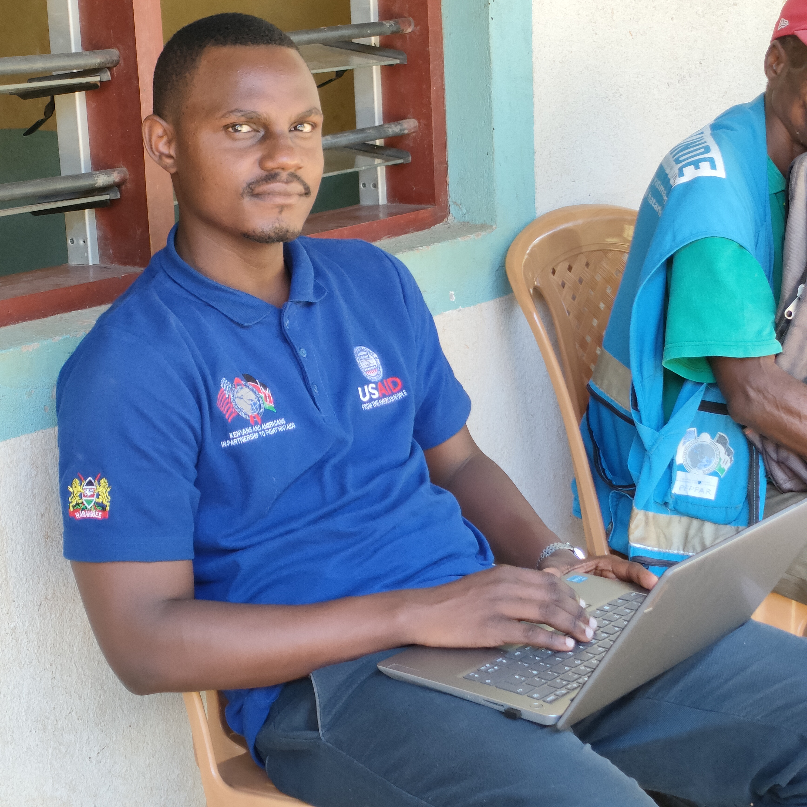
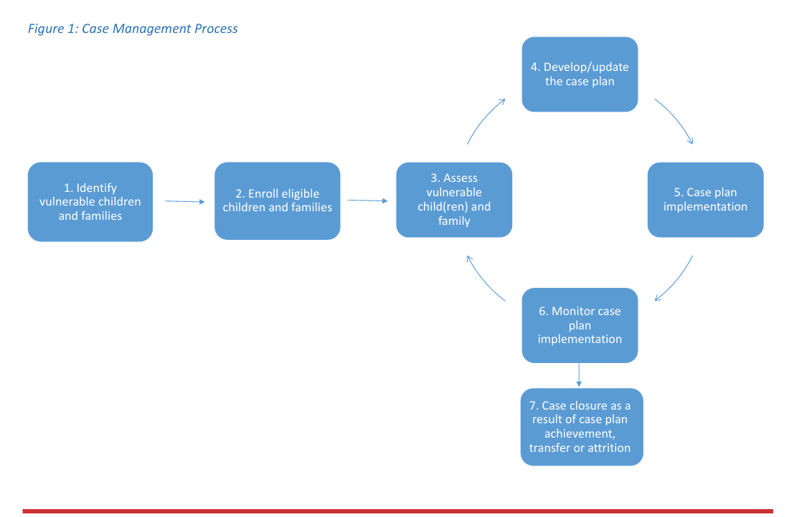
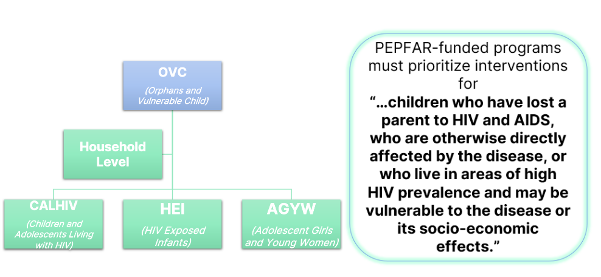
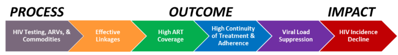
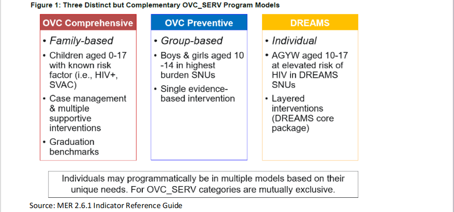
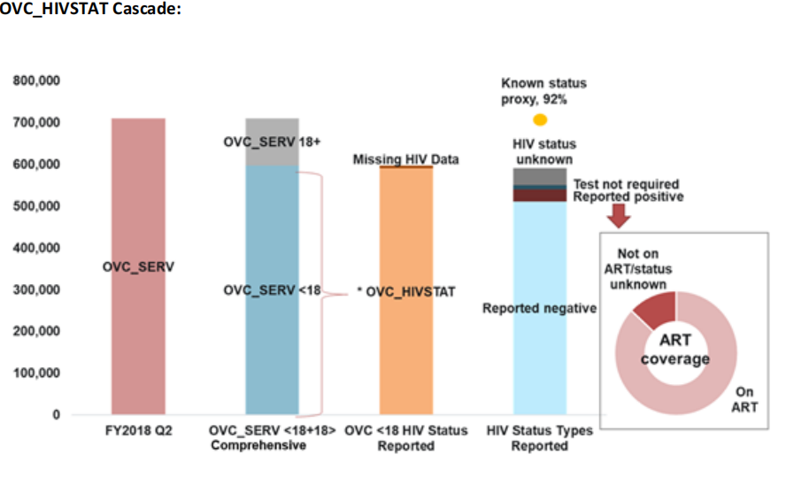
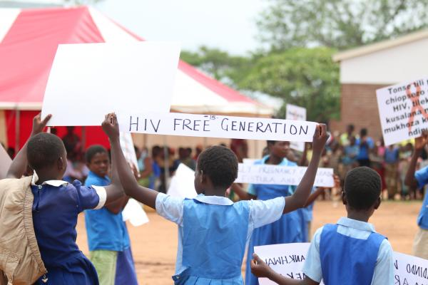
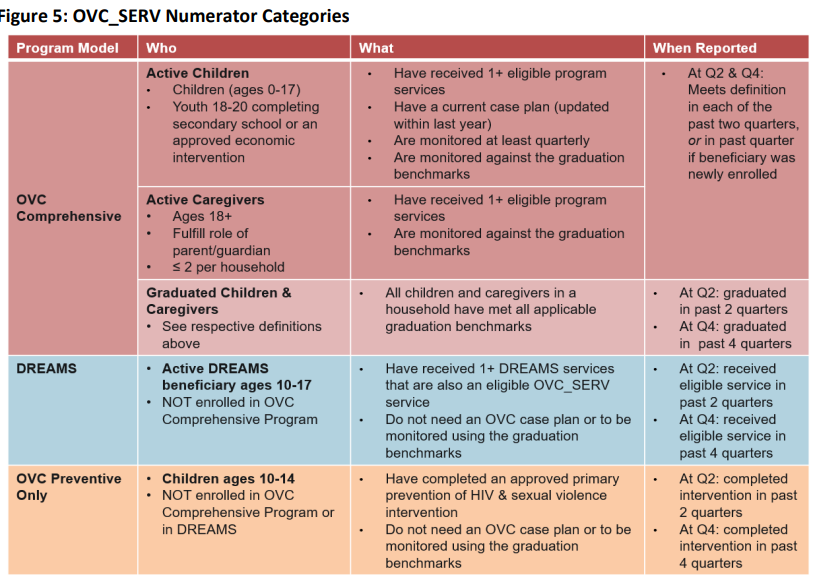
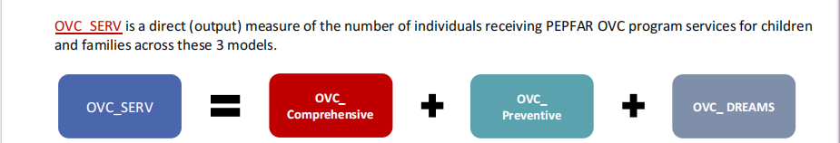
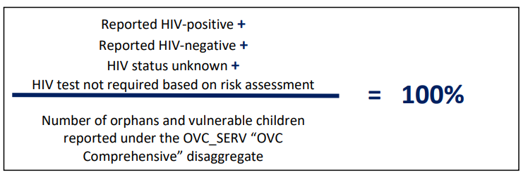

# Introduction
<table>
  <tr>
    <td style="width: 60%;">
    
      USAID Tujitegemee is a five-year project funded by USAID Kenya to implement Orphans and Vulnerable (OVC) and Determined, Resilient,  Empowered,  AIDS-free, Mentored and Safe (DREAMS) activities in Mombasa and Kilifi counties.

This is through a cooperative agreement signed with Ananda Marga Universal Relief Team (AMURT). The project is implemented by AMURT as the prime partner, and four other consortium partners that include HFG which implements DREAMS activities in Mombasa county, and in Kilifi county we have WOFAK, CIPK and KWETU implementing USAID TUJITEGEMEE project.

The USAID TUJITEGEMEE Project aims to improve the lives of Orphans and Vulnerable Children (OVC) by addressing their needs through various interventions. 

This presentation provides an overview of the key performance indicators (KPIs) used to measure the project's success.

    </td>
    <td style="width: 40%; text-align: right;">
      
    </td>
  </tr>
</table>

# Project Implementation

USAID Tujitegemee is implemented through the case management process.

PEPFAR’s Orphans and Vulnerable Children (OVC) programming delivers child-focused, family-centered interventions that seek to improve well-being and mitigate the impact of HIV and AIDS on children and families. 

This effort involves working in partnership with children and families to identify, plan, and complete a series of actions in an effort to achieve specific goals.

This process is typically referred to as case management.

# Case Management Process

  


# Target Beneficiaries

  
  
# PEPFAR Monitoring: Going from Process to Impact

The overall goal of Orphans and Vulnerable (OVC) programming is to build the resiliency of families and children affected by HIV and AIDS so that they can meet their health, economic, education, and social development needs.

  


# Program Models

<table>
  <tr>
    <td style="width: 30%;">
      USAID Tujitegemee comprises three distinct but complementary program models:
      <ul>
        <li>OVC Comprehensive</li>
        <li>OVC Preventive</li>
        <li>DREAMS</li>
      </ul>
      
      <br>
      **In the case of CIPK, only the OVC Comprehensive and OVC Preventive models are implemented.**
    </td>
    <td style="width: 70%; text-align: right;">
      
    </td>
  </tr>
</table>


# Objectives of Key Performance Indicators


<table>
  <tr>
    <td style="width: 50%;">
      <ul>
        <li>To evaluate the impact of the project on the targeted communities.</li>
        <li>To identify gaps in service delivery and areas for improvement.</li>
        <li>To track progress against set targets.</li>
      </ul>
    </td>
    <td style="width: 50%; text-align: right;">
      
    </td>
  </tr>
</table>


# Data Sources for the Presentation

The data for this analysis was collected from various reports downloaded from the 
Child Protection Information Management System (CPIMS) and PIMS, including:

<div style="display: flex; justify-content: space-around;">

<div style="flex: 1; padding: 10px;">
**CPIMS REPORTS**
- Registration List Report
- Case Plan Report
- Benchmark Report
- List of OVC Served Report
- Caregivers Served Report
- HIV Risk Screening Report
- Viral Load Report
</div>

<div style="flex: 1; padding: 10px;">
**PIMS REPORTS**
- Caregiver DCF Report
- Group Membership Report
- Loan Tracker Report
- On Path to Graduation Report
- Ready to Graduate Report
- Referral Report
- HIV Management Report
- HEI Tracking Report
- CBIM Register Report
- CBIM Sessions Report
- CBIM Survey Report
- Sinovuyo Register Report
- Teen Report
- Sinovuyo Sessions Report
</div>

</div>

# Analysis Methodology


<table>
  <tr>
    <td style="width: 50%;">

 Key performance indicators were calculated for different interventions and compared against targets. 
 
 Summary statistics and visualizations were employed to assess the progress and impact of the interventions, providing a clear view of performance relative to the set objectives.
    </td>
    <td style="width: 50%; text-align: right;">
      
    </td>
  </tr>
</table>


---

```{r Import Packages, echo=FALSE, warning=FALSE}
library(pacman)
pacman::p_load(tidyverse, janitor, readxl, writexl, openxlsx, DT, kableExtra, here,
               tidylog, patchwork)
```

```{r Import Datasets, warning=FALSE, include=FALSE, results='hide'}
##cpims data sets----------------------------------------------------------------

reglist <- read_excel(here("RegistrationListReport_01082024.xlsx"))
caseplan <- read_excel(here("CasePlanReport_01082024.xlsx"))
benchmarkreport <- read_excel(here("BenchmarkReport_01082024.xlsx"))
loos <- read_excel(here("ListOfOvcServedReport_01082024.xlsx"))
caregiverserved <- read_excel(here("CaregiversServedReport_01082024.xlsx"))
riskscreening <- read_excel(here("HivRiskScreeningReport_01082024.xlsx"))
vl <- read_excel(here("ViralLoadReport_01082024.xlsx"))

##pims data sets-----------------------------------------------------------------

caregiverdcf <- read_excel(here("caregiver_dcf__20240801071514.xlsx"))
groupmembership <- read_excel(here("group_membership_regdatatables_20240801.xlsx"))
loantracker <- read_excel(here("loan_tracker__20240801071509.xlsx"))
onpathtograduation <- read_excel(here("onpathtograduation_20240801.xlsx"))
readytograduate <- read_excel(here("readytograduate_20240801.xlsx"))
referral <- read_excel(here("referral_20240801.xlsx"))
hivmanagementReport <- read_csv(here("HIVManagementReport_20240801.csv"))
heitracking <- read_excel(here("heitracking_20240801.xlsx"))
cbimregister <- read_excel(here("cbimregister_20240801.xlsx"))
cbimsessions <- read_csv(here("cbimsessions_20240801.csv"))
cbimsurvey <- read_csv(here("cbimsurvey_20240801.csv"))
sinovuyoregister <- read_excel(here("sinovuyoregister_20240801.xlsx"))
caregiverassesmentreport <- read_csv (here("caregiverassesmentreport_20240801.csv"))
teen <- read_csv(here("teen_20240801.csv")) 
sinovuyosessions <- read_csv(here("sinovuyosessions_20240801.csv"))

```


```{r COP23 Targets, warning=FALSE, include=FALSE, results='hide'}
cop_target_sw <- data.frame(case_manager = c('Dave Mainga', 'Abdulnasir Mohammed',
                                            'Ummu Bwanamkuu', 'Armon Thinga'),
                         target = c(956, 1229, 1044, 1349)) %>% 
  rename('COP 23 Target' = 'target') %>% 
  adorn_totals('row')

sinovuyo_target_sw <- data.frame(case_manager = c('Dave Mainga', 'Abdulnasir Mohammed',
                                                 'Ummu Bwanamkuu', 'Armon Thinga'),
                              target = c(118, 156, 126, 169)) %>% 
  rename('Sinovuyo Target' = 'target') %>% 
  adorn_totals('row')

cbim_target_sw <- data.frame(case_manager = c('Dave Mainga', 'Abdulnasir Mohammed',
                                             'Ummu Bwanamkuu', 'Armon Thinga'),
                          target = c(92, 121, 97, 130)) %>% 
  rename('CBIM Target' = 'target') %>% 
  adorn_totals('row')

graduation_target_sw <- data.frame(case_manager = c('Dave Mainga', 'Abdulnasir Mohammed',
                                                   'Ummu Bwanamkuu', 'Armon Thinga'),
                                target = c(320, 428, 266, 362)) %>% 
  rename('Graduation Target' = 'target') %>% 
  adorn_totals('row')


total_targets_sw <- cop_target_sw %>% 
  left_join(sinovuyo_target_sw) %>% 
  left_join(cbim_target_sw) %>% 
  left_join(graduation_target_sw) %>% 
  adorn_totals('col') %>% 
  select(case_manager, Total) %>% 
  rename('Total Targets' = 'Total') 

#targets by constituency------------------------------------

cop_target <- data.frame(constituency = c('Kilifi North', 'Malindi'),
                           target = c(3229, 1349)) %>% 
  rename('COP 23 Target' = 'target') %>% 
  adorn_totals('row')

sinovuyo_target <- data.frame(constituency = c('Kilifi North', 'Malindi'),
                                target = c(400, 169)) %>% 
  rename('Sinovuyo Target' = 'target') %>% 
  adorn_totals('row')

cbim_target <- data.frame(constituency = c('Kilifi North', 'Malindi'),
                            target = c(310, 130)) %>% 
  rename('CBIM Target' = 'target') %>% 
  adorn_totals('row')

graduation_target <- data.frame(constituency = c('Kilifi North', 'Malindi'),
                                  target = c(1014, 362)) %>% 
  rename('Graduation Target' = 'target') %>% 
  adorn_totals('row')


total_targets <- cop_target %>% 
  left_join(sinovuyo_target) %>% 
  left_join(cbim_target) %>% 
  left_join(graduation_target) %>% 
  adorn_totals('col') %>% 
  select(constituency, Total) %>% 
  rename('Total Targets' = 'Total') 
```


# COP 23 Targets

<table>
  <tr>
    <td style="width: 30%;">
      The COP 23 targets are the President's Emergency Plan for AIDS Relief (PEPFAR) Country Operational Plan 2024.
      <br><br>
      These targets often involve key performance indicators (KPIs).
      <br><br>
      For USAID TUJITEGEMEE project, the KPIs are as follows:
      <ul>
        <li>OVC_SERV</li>
        <li>OVC_HIVSTAT</li>
      </ul>
    </td>
    <td style="width: 70%; text-align: right;">
      
    </td>
  </tr>
</table>


```{r data-processing, echo=FALSE, include=FALSE, message=FALSE, warning=FALSE}
total_targets_table <- cop_target_sw %>% 
  left_join(sinovuyo_target_sw) %>% 
  left_join(cbim_target_sw) %>% 
  left_join(graduation_target_sw) %>% 
  adorn_totals('col') %>% 
  rename('Total Targets' = 'Total',
         'Case Manager' = 'case_manager')
```

# COP 23 Targets for each Case Manager
The table below displays the COP23 Targets for each Case Manager implementing USAID TUJITGEMEE project
in Kilifi North and Malindi Sub County under Council of Imams and Preachers of Kenya (CIPK).


```{r display-table, echo=FALSE}
total_targets_table %>% 
  kableExtra::kable(align = c("l", rep("c", ncol(total_targets_table) - 1))) %>%  
  kable_styling(bootstrap_options = c("striped", "hover", "condensed", "bordered"), 
                font_size = 18, 
                position = "center") %>% 
  column_spec(1, width = "3in", background = "lightblue") %>% 
  row_spec(nrow(total_targets_table), background = "lightblue")
```


```{r Reglist Wrangling, echo=FALSE, message=FALSE, warning=FALSE}
#mutating constituency, case_manager, and satellite_office----------

caseload <- reglist %>% 
  mutate(constituency = if_else(ward %in% c('Jilore', 'Kakuyuni', 'Shella', 'Malindi Town'),
                                'Malindi', 'Kilifi North'),
         case_manager = case_when(
           constituency == 'Malindi' ~ 'Armon Thinga',
           ward %in% c('Ganda', 'Dabaso', 'Watamu') ~ 'Dave Mainga',
           ward %in% c('Tezo', 'Kibarani', 'Matsangoni') ~ 'Abdulnasir Mohammed',
           TRUE ~ 'Ummu Bwanamkuu'
         ),
         satellite_office = case_when(
           case_manager == 'Armon Thinga' ~ 'Muyeye',
           case_manager == 'Dave Mainga' ~ 'Gede',
           TRUE ~ 'Kilifi Town'))

#filter ACTIVE with duplicates----------------------

active <- caseload %>% 
  filter(exit_status == 'ACTIVE' & as.numeric(age) < 21) %>% 
  select(-exit_reason, -exit_date, -age_at_exit) %>% 
  mutate( eligible_ovc = case_when(as.numeric(age) >= 18 & schoollevel == 'Not in School' ~   'not eligible', 
                                   as.numeric(age) > 20 ~ 'not eligible',
                                   TRUE ~ 'eligible'
)) %>% 
  filter(eligible_ovc == 'eligible')


#counting unique ACTIVE OVC----------------------------
active_caseload <- active %>% 
  distinct(cpims_ovc_id, .keep_all = TRUE) %>% 
  count(case_manager, name = "Active Caseload") %>% 
  adorn_totals('row')

```


```{r LOOS PRS CPARA & Case Plan & Layering Cleaning, echo=FALSE, warning=FALSE, message=FALSE, results='hide'}
##ovc loos----------------------------------------------------------
ovcloos <- loos %>% 
  filter(as.Date(date_of_service) >= ymd(20240401) &
           !str_detect(service, 'CP99|CP910S')) %>% 
  mutate(service_code = case_when(
    service == 'CP91SCs-Enrolled in ECD' ~ 'CP 9.1 SC',
    service == 'CP92SCs-Re-enrolled back to school (incuding teenage mothers)' ~ 'CP 9.1 SC',
    service == 'CP93SCs-Adolescent (15-20 yrs) enrolled in an approved HES intervention  including VTC' ~ 'CP 9.3 SC',
    service == 'CP93SCs-Adolescent (15-20 yrs) enrolled in an approved HES intervention including VTC' ~ 'CP 9.3 SC',
    service == 'CP94aSCs-School fees paid' ~ 'CP 9.4 SC',
    service == 'CP94bSCs-Complete referral for bursary or other educational support' ~ 'CP 9.4 SC',
    service == 'CP95SCs-School levies paid' ~ 'CP 9.5 SC',
    service == 'CP96SCs-Scholastic materials provided' ~ 'CP 9.6 SC',
    service == 'CP97SCs-School uniform provided' ~ 'CP 9.7 SC',
    service == 'CP98aSCs-Sanitary towels provided' ~ 'CP 9.8 SC',
    service == 'CP98bSCs-Completed referral for provision of Sanitary towels' ~ 'CP 9.8 SC',
    service == 'CP99SCs-Child received Regular Assistance with homework' ~ 'CP 9.9 SC',
    service == 'CP910SCs-Child school progression monitored' ~ 'CP 9.10 SC',
    service == 'CP911aSCs Lighting equipment provided (e.g. solar lamps)' ~ 'CP 9.11 SC',
    service == 'CP911bSCs Completed referral for lighting equipment (e.g. solar lamps)' ~ 'CP 9.11 SC',
    service == 'CP11HEs-Facilitated to obtain HIV test' ~ 'CP 1.1 HE',
    service == 'CP12HEs -Completed a referral for HIV test' ~ 'CP 1.2 HE',
    service == 'CP13HEs -Completed a referral for Early Infant Diagnosis (EID)' ~ 'CP 1.3 HE',
    service == 'CP14HEs -Facilitated to obtain Early Infant Diagnosis (EID)' ~ 'CP 1.4 HE',
    service == 'CP21HEs -Completed a referral for enrollment to care and treatment' ~ 'CP 2.1 HE',
    service == 'CP22aHEs -Facilitated to access viral load testing services' ~ 'CP 2.2 HE',
    service == 'CP22bHEs -Completed referral to access viral load testing services' ~ 'CP 2.2 HE',
    service == 'CP23HEs -Provided with transport to clinic appointment' ~ 'CP 2.3 HE',
    service == 'CP24HEs -Provided with appointment reminder messages' ~ 'CP 2.4 HE',
    service == 'CP25HEs -Provided with age-appropriate counseling and HIV disclosure support' ~ 'CP 2.5 HE',
    service == 'CP26HEs -Provided with age-appropriate HIV treatment literacy' ~ 'CP 2.6 HE',
    service == 'CP27HEs -Completed a referral for HIV related opportunistic infection treatment and care' ~ 'CP 2.7 HE',
    service == 'CP28HEs -Linked to age appropriate support group eg Peer clubs, OTZ club' ~ 'CP 2.8 HE',
    service == 'CP29HEs -Adolescent Linked to a structured PLHA support group' ~ 'CP 2.9 HE',
    service == 'CP210aHEs -Provided with HIV adherence support (wristwatch)' ~ 'CP 2.10 HE',
    service == 'CP210bHEs -Provided with HIV adherence support (Pill box)' ~ 'CP 2.10 HE',
    service == 'CP210cHEs -Provided with HIV adherence support (Treatment buddy)' ~ 'CP 2.10 HE',
    service == 'CP210dHEs -Provided with HIV adherence support (Direct Witnessed Ingestion)' ~ 'CP 2.10 HE',
    service == 'CP210eHEs -Provided with HIV adherence support (Enhanced Adherence Counseling)' ~ 'CP 2.10 HE',
    service == 'CP210fHEs -Provided with HIV adherence support (MDT)' ~ 'CP 2.10 HE',
    service == 'CP211aHEs -Facilitated to obtain routine/ emergency healthcare' ~ 'CP 2.11 HE',
    service == 'CP211bHEs -Completed a referral to obtain routine/ emergency healthcare' ~ 'CP 2.11 HE',
    service == 'CP212HEs -Provided with age-appropriate health and nutrition messages' ~ 'CP 2.12 HE',
    service == 'CP213aHEs -Facilitated to obtain STI treatment'  ~ 'CP 2.13 HE',
    service == 'CP213b HEs -Completed a referral to obtain STI treatment' ~ 'CP 2.13 HE',
    service == 'CP31HEs-Completed a referral to obtain age-appropriate HIV prevention support including PrEP, condoms and/or VMMC' ~ 'CP 3.1 HE',
    service == 'CP32HEs-Provided with HIV and Violence prevention evidence interventions sessions' ~ 'CP 3.2 HE',
    service == 'CP33HEs-Completed a referral to obtain age-appropriate women’s health counseling and/or products, including condoms' ~ 'CP 3.3 HE',
    service == 'CP41aHEs-Provided with MUAC and Bipedal Oedema Assessment' ~ 'CP 4.1 HE',
    service == 'CP41bHEs-Completed referral for MUAC and  bipedal edema assessment' ~ 'CP 4.1 HE',
    service == 'CP41bHEs-Completed referral for MUAC and bipedal edema assessment' ~ 'CP 4.1 HE',
    service == 'CP42HEs-Completed a referral to be provided with supplementary or therapeutic food' ~ 'CP 4.2 HE',
    service == 'CP43HEs-Completed referral for nutrition, growth, and developmental monitoring services' ~ 'CP 4.3 HE',
    service == 'CP44aHEs-Facilitated to obtain immunization' ~ 'CP 4.4 HE',
    service == 'CP44bHEs-Completed a referral to obtain immunization' ~ 'CP 4.4 HE',
    service == 'CP45aHEs-Provided with Insecticide Treated Mosquito net (ITN)' ~ 'CP 4.5 HE',
    service == 'CP45bHEs-Completed referral to obtain Insecticide Treated Mosquito net (ITN)' ~ 'CP 4.5 HE',
    service == 'CP46aHEs-Facilitated to obtain perinatal care including PMTCT' ~ 'CP 4.6 HE',
    service == 'CP46bHEs-Completed referral to obtain perinatal care including PMTCT' ~ 'CP 4.6 HE',
    service == 'CP53aSTs -OVC Provided with business support (startup kit)' ~ 'CP 5.3 ST',
    service == 'CP53bSTs -OVC completed referral for business support (startup kit)' ~ 'CP 5.3 ST',
    service == 'CP55STs-OVC Linked to saving groups' ~ 'CP 5.5 ST',
    service == 'CP57aSTs-Adolescent (15-20 yrs) provided with training on Financial Literacy' ~ 'CP 5.7 ST',
    service == 'CP 5.7b STs-Adolescent (15-20 yrs) completed referral for training on Financial Literacy' ~ 'CP 5.7 ST',
    service == 'CP58aSTs-Adolescent (15-20 yrs) provided with training on Entrepreneurship' ~ 'CP 5.8 ST',
    service == 'CP58bSTs-Adolescent (15-20 yrs) completed referral for Entrepreneurship training' ~ 'CP 5.8 ST',
    service == 'CP59aSTs-Adolescent (15-20 yrs) provided with Agribusiness skills training' ~ 'CP 5.9 ST',
    service == 'CP59bSTs-Adolescent (15-20 yrs) completed referral for Agribusiness skills training' ~ 'CP 5.9 ST',
    service == 'CP510aSTs-Adolescent (15-20 yrs) Provided with support for vocational training/apprenticeship' ~ 'CP 5.10 ST',
    service == 'CP510bSTs-Adolescent (15-20 yrs) completed referral for vocational training/apprenticeship' ~ 'CP 5.10 ST',
    service == 'CP511STs-Linked to internship/apprenticeship and or job opportunities' ~ 'CP 5.11 ST',
    service == 'CP61SAs-Conducted structured family group conferencing to prevent occurrence/ reoccurrence of child abuse, exploitation or neglect' ~ 'CP 6.6 SA',
    service == 'CP63aSAs-Facilitated with transport to access post-violence medical care' ~ 'CP 6.3 SA',
    service == 'CP63bSAs-OVC Completed a referral for post-violence medical care' ~ 'CP 6.3 SA',
    service == 'CP64SAs-Suspected abuse case reported to child protection office, police or other local authority and safety plan developed' ~ 'CP 6.4 SA',
    service == 'CP65SAs-Completed referral for emergency shelter/care facility' ~ 'CP 6.5 SA',
    service == 'CP66SAs-Adolescent received structured safe spaces intervention' ~ 'CP 6.6 SA',
    service == 'CP67SAs-Adolescent completed evidenced-based intervention on preventing HIV and sexual violence' ~ 'CP 6.7 SA',
    service == 'CP611aSAs-Facilitated to access legal assistance (e.g., attorney fees, transport, etc.) related to cases of maltreatment ie physical abuse, neglect, emotional abuse and sexual abuse, trafficking, exploitation' ~ 'CP 6.11 SA',
    service == 'CP611bSAs-Completed referral for legal assistance (e.g., attorney fees, transport, etc.) related to cases of maltreatment, GBV, trafficking, exploitation' ~ 'CP 6.11 SA',
    service == 'CP71aSAs-Provided with emergency shelter/care facility or kinship care placement' ~ 'CP 7.1 SA',
    service == 'CP71bSAs-Completed referral for emergency shelter/care facility or kinship care placement and monitoring for children' ~ 'CP 7.1 SA',
    service == 'CP81aSAs-Facilitated acquisition of Birth' ~ 'CP 8.1 SA',
    service == 'CP81bSAs-Completed referral for acquisition of Birth' ~ 'CP 8.1 SA',
    TRUE ~ '')) %>% 
  distinct(cpims_ovc_id, date_of_service, service_code, .keep_all = TRUE) %>% 
  mutate(age_at_service = round(trunc(dob %--% date_of_service) / years(1),1),
         service_appropriateness = case_when(
           service %in% c('CP11HEs-Facilitated to obtain HIV test','CP12HEs -Completed a referral for HIV test') & 
             ovchivstatus == 'POSITIVE' ~ 'inappropriate - service for non CALHIV',
           service == 'CP13HEs -Completed a referral for Early Infant Diagnosis (EID)' & 
             ovchivstatus != 'HEI NOT KNOWN' ~ 'inappropriate -  service for HEI',
           str_detect(service, 'CP21|CP22|CP24|CP25|CP26|CP27|CP29|CP21') & 
             ovchivstatus != 'POSITIVE' ~ 'inappropriate service - service for CALHIV',
           str_detect(service, 'CP28|CP31|CP32') & as.numeric(age) <10 ~ 'inappropriate - service for 10+',
           str_detect(service, 'CP41|CP42|CP43|CP45') & as.numeric(age_at_service) >= 5 ~ 'inappropriate - service for <5',
           str_detect(service, 'CP44') & as.numeric(age_at_service) >= 2 ~ 'inappropriate - service for <2',
           str_detect(service, 'CP51') & as.numeric(age_at_service) < 15 ~ 'inappropriate - service for adolescents',
           str_detect(service, 'CP57') & as.numeric(age_at_service) < 17 ~ 'inappropriate - service for 17+',
           str_starts(service, 'CP8') & birthcert == 'NO BIRTHCERT' ~ 'inappropriate - OVC has no birth',
           str_detect(service, 'CP91') & schoollevel != 'ECDE' ~ 'inappropriate - service for ECDE-going OVC',
           str_starts(service, 'CP9') & schoollevel == 'Not in School' ~ 'inappropriate - service for school_going OVC',
           TRUE ~ 'appropriate service'
         )) %>% 
  select(constituency, ward, ovc_names, cpims_ovc_id, dob,age, age_at_service, agerange, 
         gender,birthcert, ovchivstatus,
         schoollevel,
         service, service_code, date_of_service,
         service_appropriateness) %>% 
  filter(service_appropriateness == 'appropriate service')


loos_q3 <- ovcloos %>% 
  filter(between(as.Date(date_of_service), ymd(20240401), ymd(20240630))) 


loos_q4 <- ovcloos %>% 
  filter(between(as.Date(date_of_service), ymd(20240701), ymd(20240930))) 


##caregiver served----------------------------------------------------

apr_cg_services <- caregiverserved %>% 
  filter(as.Date(date_of_event)>=ymd(20240401))

caregiverserved_q3 <- caregiverserved %>% 
  filter(between(as.Date(date_of_event), ymd(20240401), ymd(20240630)))


caregiverserved_q4 <- caregiverserved %>% 
  filter(between(as.Date(date_of_event), ymd(20240701), ymd(20240731)))


trickle_q3 <- caregiverserved %>% 
  filter(between(as.Date(date_of_event), ymd(20240401), ymd(20240630)) & 
           str_starts(service, 'CP5'))


trickle_q4 <- caregiverserved %>% 
  filter(between(as.Date(date_of_event), ymd(20240701), ymd(20240731)) & 
           str_starts(service, 'CP5'))

##risk screening--------------------------------------------------------------


prs <- riskscreening %>% 
  mutate(date_of_prs = as.Date(date_of_event),
         prs_months = round(trunc(date_of_prs %--% ymd(20240731))/months (1),1),
         prs_validity = if_else(prs_months <= 6, 'valid - within 6 months',
                                'not valid - more than 6 months')) %>% 
  arrange(cpims_ovc_id, desc(date_of_prs)) %>% 
  select(cpims_ovc_id, date_of_prs, prs_validity, was_hiv_test_done_less_than_6_months_ago, test_donewhen_result, caregiver_know_the_status_of_the_child, caregiver_know_the_status_of_the_child_positive_negative, is_biological_parent_siblings_of_the_child_plhiv, child_persistenetly_sick_malnourished, child_exposed_to_sexual_abuse,
         child_subjected_to_traditional_non_medical_procedures, have_you_been_persistently_sick_in_the_past_3_months, have_you_had_tb_in_the_last_12_months, sexually_abuse_defiled_or_been_physically_forced_to_sexual_inte, unprotected_sexual_intercourse_in_the_past_6_months, symptoms_of_sexually_transmitted_infections, iv_drug_user_sharing_needles, child_adolescent_youth_have_yes_to_question_2_to_10, parent_accept_hiv_testing_for_the_child, parent_consent_date, formal_referral_made_for_hiv_testing, formal_referral_made_for_hiv_testing_date,
         referal_for_hiv_testing_completed, referal_for_hiv_testing_completed_date, no_formal_referral_made_report_why_not, test_result,
         hiv_positive_3b_was_the_child_referred_for_art, art_referral_date, hiv_positive_3b_was_the_art_referral_completed, was_the_art_referral_completed_date,
         facility_of_child_art_enrollment) %>% 
  distinct(cpims_ovc_id, .keep_all = TRUE) %>% 
  filter(prs_validity == 'valid - within 6 months')


#cpara--------------------------------------------------------------

active_cpara <- benchmarkreport %>% 
  mutate(cpara_months = round(trunc(as.Date(date_of_event) %--% ymd(20240731)) / months (1), 1),
         cpara_validity = if_else(cpara_months > 12, 'invalid - more than 12 months', 'valid')) %>% 
  select(cbo, constituency, ward, caregiver_id, caregiver_names, date_of_cpara = date_of_event,
         benchmark_1:cpara_validity) %>% 
  arrange(caregiver_id, desc(date_of_cpara)) %>% 
  distinct(caregiver_id, .keep_all = TRUE)


cpara <- active_cpara %>% 
  select(caregiver_id, date_of_cpara, cpara_validity, cpara_score, graduation_pathway)

#active caseplan-------------------------------------------


active_caseplan <- caseplan %>% 
  left_join(cpara) %>% 
  mutate(caseplan_months = round(trunc(as.Date(date_of_event) %--% ymd(20240731)) / months(1),
                                 1),
         caseplan_validity = if_else(caseplan_months > 12, 'invalid - more than 12 momths',
                                     'active caseplan'),
         matching_cpara = if_else(date_of_event >= date_of_cpara, 'matching', 'not matching'),
         age_at_need_identification = round(as.numeric(difftime(date_of_event, dob, 
                                                                units = "days")) / 365.25, 1),
         constituency = case_when(
           constituency == 'Malindi' ~ 'Armon Thinga',
           ward %in% c('Dabaso', 'Watamu', 'Matsangoni') ~ 'Dave Mainga',
           ward %in% c('Sokoni', 'Mnarani') ~ 'Ummu Bwanamkuu',
           TRUE ~ 'Abdulnasir Mohammed'
         )) %>% 
  select(cbo, constituency, constituency, ward, chv_names, caregiver_id, caregiver_names,
         cpims_ovc_id, ovc_names, dob, age, agerange, gender, birthcert, ovchivstatus,
         facility,  schoollevel, class, registration_date, exit_status, date_of_cpara,
         cpara_validity, cpara_score,
         date_of_caseplan = date_of_event, matching_cpara, caseplan_validity,
         age_at_need_identification,
         domains:service) %>% 
  rename(caseplan_need = service) %>% 
  filter(caseplan_validity == 'active caseplan') %>% 
  distinct(cpims_ovc_id, caseplan_need, .keep_all = TRUE) %>% 
  mutate(service_code = case_when(
    caseplan_need == 'CP 9.1 SC Enroll in ECD' ~ 'CP 9.1 SC',
    caseplan_need == 'CP 9.2 SC Re-enrol child back to school (including teenage mothers)' ~ 'CP 9.2 SC',
    caseplan_need == 'CP 9.3 SC Enroll Adolescent (15-20 yrs) in an approved HES intervention including VTC' ~ 'CP 9.3 SC',
    caseplan_need == 'CP 9.4 SC Provide school fees or complete referral for bursary or other educational support' ~  'CP 9.4 SC',
    caseplan_need == 'CP 9.5 SC Complete referral for or provide school levies support' ~ 'CP 9.5 SC',
    caseplan_need == 'CP 9.6 SC Complete referral for or provide scholastic materials' ~ 'CP 9.6 SC',
    caseplan_need == 'CP 9.7 SC Provide school uniform support' ~ 'CP 9.7 SC',
    caseplan_need == 'CP 9.8 SC Complete referral for or provide sanitary towels to adolescent girls' ~ 'CP 9.8 SC',
    caseplan_need == 'CP 9.9 SC Provide assistance with homework' ~ 'CP 9.9 SC',
    caseplan_need == 'CP 9.10 SC Monitor child progression in school' ~ 'CP 9.10 SC',
    caseplan_need == 'CP 1.1 HE Facilitate to obtain HIV test' ~ 'CP 1.1 HE',
    caseplan_need == 'CP 1.2 HE Complete a referral for HIV test' ~ 'CP 1.2 HE',
    caseplan_need == 'CP 1.3 HE Complete a referral for Early Infant Diagnosis (EID)' ~ 'CP 1.3 HE',
    caseplan_need == 'CP 1.4 HE Facilitate to obtain Early Infant Diagnosis (EID)' ~ 'CP 1.4 HE',
    caseplan_need == 'CP 2.1 HE Complete a referral for enrollment to care and treatment' ~ 'CP 2.1 HE',
    caseplan_need == 'CP 2.2 HE Complete referral/facilitated to access viral load testing services' ~ 'CP 2.2 HE',
    caseplan_need == 'CP 2.3 HE Facilitate/provided with transport to clinic appointment' ~ 'CP 2.3 HE',
    caseplan_need == 'CP 2.4 HE Provide with appointment reminder messages' ~ 'CP 2.4 HE',
    caseplan_need == 'CP 2.5 HE Provide with age-appropriate counseling and HIV disclosure support' ~ 'CP 2.5 HE',
    caseplan_need == 'CP 2.6 HE Provide with age-appropriate HIV treatment literacy (for CLHIV)' ~ 'CP 2.6 HE',
    caseplan_need == 'CP 2.7 HE Complete a referral for HIV related opportunistic infection treatment and care' ~ 'CP 2.7 HE',
    caseplan_need == 'CP 2.8 HE Link to age appropriate OTZ club' ~ 'CP 2.8 HE',
    caseplan_need == 'CP 2.9 HE Link to a structured PLHA support group' ~ 'CP 2.9 HE',
    caseplan_need == 'CP 2.10 HE Provide with HIV adherence support (wristwatch, pill box, treatment buddy, EAC, DWI, Counseling, MDT)' ~ 'CP 2.10 HE',
    caseplan_need == 'CP 2.11 HE Complete a referral for routine/ emergency healthcare' ~ 'CP 2.11 HE',
    caseplan_need == 'CP 2.12 HE Provide with age-appropriate health and nutrition messages' ~ 'CP 2.12 HE',
    caseplan_need == 'CP 2.13 HE Complete a referral for STI treatment' ~ 'CP 2.13 HE',
    caseplan_need == 'CP 3.1 HE Complete a referral to obtain age-appropriate HIV prevention support including PrEP, condoms and/or VMMC' ~ 'CP 3.1 HE',
    caseplan_need == 'CP 3.2 HE Provide HIV and Violence prevention evidence interventions sessions' ~ 'CP 3.2 HE',
    caseplan_need == 'CP 3.2 HE Complete a referral for women’s health counseling and/or products, including condoms' ~ 'CP 3.2 HE',
    caseplan_need == 'CP 4.1 HE Complete referral for MUAC assessment and bipedal edema' ~ 'CP 4.1 HE',
    caseplan_need == 'CP 4.2 HE Provide supplementary or therapeutic food' ~ 'CP 4.2 HE',
    caseplan_need == 'CP 4.3 HE Complete referral for nutrition, growth, and developmental monitoring services' ~ ' CP 4.3 HE',
    caseplan_need == 'CP 4.4 HE Complete a referral for immunization' ~ 'CP 4.4 HE',
    caseplan_need == 'CP 4.5 HE Complete referral for Insecticide Treated Mosquito net (ITN)' ~ 'CP 4.5 HE',
    caseplan_need == 'CP 4.6 HE Complete referral for perinatal care including PMTCT' ~ 'CP 4.6 HE',
    caseplan_need == 'CP 4.7 HE Provide hygiene counseling and WASH messaging' ~ 'CP 4.7 HE',
    caseplan_need == 'CP 5.1 ST Link to GOK and other social safety nets (OVC, Elderly or Disability cash transfers)' ~ 'CP 5.1 ST',
    caseplan_need == 'CP 5.2 ST Provide Emergency/cash transfer' ~ 'CP 5.2 ST',
    caseplan_need == 'CP 5.3 ST Provide or complete referral for business support (startup kit/business boost)' ~ 'CP 5.3 ST',
    caseplan_need == 'CP 5.4 ST Provide or complete referral for productive assets)' ~ 'CP 5.4 ST',
    caseplan_need == 'CP 5.5 ST Enroll to saving groups (VSLA/SILC)' ~ 'CP 5.5 ST',
    caseplan_need == 'CP 5.6 ST Link to financial institutions' ~ 'CP 5.6 ST',
    caseplan_need == 'CP 5.7 ST Provide or complete referral for Financial literacy training to CG and adolescent' ~ 'CP 5.7 ST',
    caseplan_need == 'CP 5.8 ST Provide or complete referral for Entrepreneurship training' ~ 'CP 5.8 ST',
    caseplan_need == 'CP 5.9 ST Provide or complete referral for Agribusiness skills training' ~ 'CP 5.9 ST',
    caseplan_need == 'CP 5.10 ST Provide or complete referral for vocational training/ apprenticeship' ~ 'CP 5.10 ST',
    caseplan_need == 'CP 5.11 ST Link to internship and or job opportunities' ~ 'CP 5.11 ST',
    caseplan_need == 'CP 5.12 ST Enroll or complete referral for health insurance plan ( e.g. NHIF, UHC)' ~ 'CP 5.12 ST',
    caseplan_need == 'CP 5.13 ST Provided with or referred for legal and other administrative fees support related to guardianship, civil registration or inheritance' ~ 'CP 5.13 ST',
    caseplan_need == 'CP 6.1 SA Conduct structured family group conferencing to prevent occurrence/ reoccurrence of child abuse, exploitation or neglect' ~ 'CP 6.1 SA',
    caseplan_need == 'CP 6.2 SA Provide structured psycho-social support related to family conflict mitigation and family relationships' ~ 'CP 6.2 SA',
    caseplan_need == 'CP 6.3 SA Complete a referral for post-violence medical care' ~ 'CP 6.3 SA',
    caseplan_need == 'CP 6.4 SA File report of suspected abuse to child protection office, police or other local authority' ~ 'CP 6.4 SA',
    caseplan_need == 'CP 6.5 SA Refer for emergency shelter/care facility' ~ 'CP 6.5 SA',
    caseplan_need == 'CP 6.6 SA Engage/complete referral of adolescent structured safe spaces intervention' ~ 'CP 6.6 SA',
    caseplan_need == 'CP 6.7 SA Facilitate or complete referral for participation in evidence-based intervention on preventing HIV and sexual violence' ~ 'CP 6.7 SA',
    caseplan_need == 'CP 6.8 SA Support caregiver to access structured psycho- social support related to family conflict mitigation and family relationships' ~ 'CP 6.8 SA',
    caseplan_need == 'CP 6.9 SA Enroll or complete referral of caregiver for a structured, HIV-sensitive, evidence-based early childhood intervention with a trained provider' ~ 'CP 6.9 SA',
    caseplan_need == 'CP 6.10 SA Enroll caregiver for an evidence-based parenting intervention to prevent and reduce violence and/or sexual risk of their children' ~ 'CP 6.10 SA',
    caseplan_need == 'CP 6.11 SA Provide or complete referral for legal assistance related to cases of maltreatment, GBV, trafficking, exploitation' ~ 'CP 6.11 SA',
    caseplan_need == 'CP 7.1 SA Provide or complete referral for emergency shelter/care facility or kinship care placement and monitoring for children' ~ 'CP 7.1 SA',
    caseplan_need == 'CP 8.1 SA Facilitate/complete referral for acquisition of Birth certificate' ~ 'CP 8.1 SA',
    caseplan_need == 'CP 6.3 SA Complete a referral for or facilitate to obtain post-violence medical care' ~ 'CP 6.3 SA',
    caseplan_need == 'Complete a referral for HIV related opportunistic infection treatment and care' ~ 'CP 2.7 HE',
    caseplan_need == 'Complete a referral for HIV test' ~ 'CP 1.2 HE',
    caseplan_need == 'Complete a referral for or facilitated to obtain routine/ emergency healthcare' ~ 'CP 2.11 HE',
    caseplan_need == 'Complete a referral for/facilitated to obtain immunization' ~ 'CP 4.4 HE',
    caseplan_need == 'Complete a referral to obtain age-appropriate HIV prevention support including PrEP, condoms and/or VMMC' ~ 'CP 3.1 HE',
    caseplan_need == 'Complete referral for MUAC assessment and bipedal edema' ~ 'CP 4.1 HE',
    caseplan_need == 'Complete referral for/facilitated to obtain nutrition, growth, and developmental monitoring services' ~ 'CP 4.3 HE',
    caseplan_need == 'Complete referral/facilitated to obtain perinatal care including PMTCT' ~ 'CP 4.6 HE',
    caseplan_need == 'HE Facilitate to obtain HIV test' ~ 'CP 1.1 HE',
    caseplan_need == 'Link to a structured PLHA support group' ~ 'CP 2.9 HE',
    caseplan_need == 'Link to age appropriate OTZ club' ~ 'CP 2.8 HE',
    caseplan_need == 'Provide with HIV adherence support (wristwatch, pill box, treatment buddy, EAC, DWI, Counseling, MDT)' ~ 'CP 2.10 HE',
    caseplan_need == 'Provide with HIV and Violence prevention evidence interventions sessions' ~ 'CP 3.2 HE',
    caseplan_need == 'Provide with age-appropriate HIV treatment literacy (for CLHIV)' ~ 'CP 2.6 HE',
    caseplan_need == 'Provide with age-appropriate health and nutrition messages' ~ 'CP 2.12 HE',
    caseplan_need == 'Provide with supplementary or therapeutic food' ~ 'CP 4.2 HE',
    TRUE ~ ''
  ),
  benchmark_of_need = case_when(
    str_detect(service_code, 'CP 1') ~ 'Benchmark 1',
    str_detect(service_code, 'CP 2') ~ 'Benchmark 2',
    str_detect(service_code, 'CP 3') ~ 'Benchmark 3',
    str_detect(service_code, 'CP 4') ~ 'Benchmark 4',
    str_detect(service_code, 'CP 5') ~ 'Benchmark 5',
    str_detect(service_code, 'CP 6') ~ 'Benchmark 6',
    str_detect(service_code, 'CP 7') ~ 'Benchmark 7',
    str_detect(service_code, 'CP 8') ~ 'Benchmark 8',
    str_detect(service_code, 'CP 9') ~ 'Benchmark 9',
    TRUE ~ '')) %>% 
  distinct(cpims_ovc_id, service_code, date_of_caseplan, .keep_all = TRUE)  %>% 
  arrange(chv_names, caregiver_names, desc(age)) %>% 
  filter(service_code != 'CP 9.9 SC') 


needs <- active_caseplan %>%
  mutate(appropriate_caseplan = case_when(
    service_code %in% c('CP 2.1 HE', 'CP 2.2 HE', 
                        'CP 2.4 HE', 'CP 2.5 HE', 'CP 2.6 HE','CP 2.7 HE',
                        'CP 2.8 HE', 'CP 2.11 HE', 'CP 2.10 HE',
                        'CP 2.12 HE') & 
      ovchivstatus %in% c('NEGATIVE', 'HIV Test Not Required', 'HEI NOT KNOWN') ~ 'inappropriate need - need for CALHIV',
    service_code == 'CP 2.3 HE' & ovchivstatus %in% c('NEGATIVE', 'HIV Test Not Required') ~ 'inappropriate need - need for CALHIV/HEI',
    service_code == 'CP 4.4 ST' & as.numeric(age_at_need_identification) >= 2 ~ 'inappropriate need - need for child below two years',
    service_code %in% c('CP 4.1 HE', 'CP 4.2 HE', 'CP 4.3 HE', 'CP 4.5 HE', 'CP 4.7 HE') & as.numeric(age_at_need_identification) >= 5 ~ 'inappropriate need - need for OVC < 5 years',
    gender == 'Male' & service_code == 'CP 9.8 SC' ~ 'inappropriate need - need for adolescents girls',
    gender == 'Female' & service_code == 'CP 9.8 SC' & as.numeric(age) < 10 ~ 'inappropriate need - need for adolescents girls',
    service_code == 'CP 5.3 ST' & cpara_score < 5 ~ 'inappropriate need - need for household scoring 5 & above',
    service_code == 'CP 5.4 ST' & cpara_score < 5 ~ 'inappropriate need - need for household scoring 5 & above',
    service_code == 'CP 5.12 ST' & cpara_score > 4 ~ 'inappropriate need - need for household scoring below 5',
    service_code == 'CP 5.2 ST' & cpara_score > 4 ~ 'inappropriate need - need for household scoring below 5',
    benchmark_of_need %in% c('Benchmark 6','Benchmark 7') ~ 'confirm whether a case of violence truly occurred. If not, clean the service',
    service_code %in% c('CP 1.1 HE', 'CP 1.2 HE') & ovchivstatus == 'POSITIVE' ~ 'inappropriate need - need for non calhiv',
    service_code == "" ~ 'key in the case plan correctly',
    benchmark_of_need == 'Benchmark 3' & as.numeric(age) < 10 ~ 'inappropriate need - need for adolescents 10-17 yrs',
    service_code == 'CP 9.3 SC' & as.numeric(age_at_need_identification) < 17 ~ 'inappropriate need - need for OVC above 17',
    service_code == 'CP 9.1 SC' & as.numeric(age) < 3 ~ 'inappropriate need - need for school-going age children',
    service_code == 'CP 9.1 SC' & schoollevel %in% c('Primary', 'Secondary', 'Tertiary') ~ 'inappropriate need - need for ECDE children',
    service_code == 'CP 9.2 SC' & as.numeric(age) < 5 ~ 'inappropriate need - need for school-going age children',
    service_code == 'CP 9.3 SC' & as.numeric(age) >= 15 ~ 'inappropriate need - need for above 15',
    service_code %in% c('CP 9.4 SC', 'CP 9.5 SC') & as.numeric(age) < 4 ~ 'inappropriate need - need for school-going age children',
    service_code %in% c('CP 9.6 SC', 'CP 9.7 SC', 'CP 9.9 SC', 'CP 9.10 SC') & as.numeric(age) < 4 ~ 'inappropriate need - need for school-going age children',
    TRUE ~ 'appropriate_need'
  )) 


appropriate_need <- needs %>% 
  filter(appropriate_caseplan == 'appropriate_need')


####case plan category---------------------------------------------------------

individual_caseplan <- appropriate_need %>% 
  filter(!str_detect(service_code, 'CP 5.'))

hh_caseplan <- appropriate_need %>% 
  filter(str_detect(service_code, 'CP 5.'))
```


```{r Active Caseload Wrangling, echo=FALSE, message=FALSE, warning=FALSE}
#active caseload-------------------------------------------------

activeovc <- active %>%
  distinct(cpims_ovc_id, .keep_all = TRUE) %>%
    mutate(
    caseplan_status = case_when(
      cpims_ovc_id %in% appropriate_need$cpims_ovc_id ~ 'has caseplan',
      caregiver_id %in% hh_caseplan$caregiver_id ~ 'hh caseplan',
      TRUE ~ 'no caseplan'
    ),
        served_q3 = case_when(
      cpims_ovc_id %in% loos_q3$cpims_ovc_id ~ 'served',
      caregiver_id %in% trickle_q3$caregiver_cpimsid ~ 'served trickle',
      TRUE ~ 'not served'
    ),
        served_q4 = case_when(
      cpims_ovc_id %in% loos_q4$cpims_ovc_id ~ 'served',
      TRUE ~ 'not served'
    ),
    
    ovc_serv = case_when(
      # Served both quarters with a caseplan
      served_q3 %in% c('served', 'served trickle') &
        served_q4 %in% c('served', 'served trickle') &
        caseplan_status %in% c('has caseplan', 'hh caseplan') ~ 'served both quarters',
      
      # New registration served in Q4 with a caseplan
      as.Date(registration_date) >= ymd(20240701) &
        served_q4 %in% c('served', 'served trickle') & 
        caseplan_status %in% c('has caseplan', 'hh caseplan') ~ 'served both quarters',
      
      # Served one quarter with a caseplan
      served_q3 %in% c('served', 'served trickle') & 
        served_q4 == 'not served' &
        caseplan_status %in% c('has caseplan', 'hh caseplan') ~ 'served one quarter with caseplan',
      
      served_q4 %in% c('served', 'served trickle') & 
        served_q3 == 'not served' &
        caseplan_status %in% c('has caseplan', 'hh caseplan') ~ 'served one quarter with caseplan',
      
      # Served one quarter without a caseplan
      served_q3 %in% c('served', 'served trickle') & 
        served_q4 == 'not served' &
        caseplan_status == 'no caseplan' ~ 'served one quarter without caseplan',
      
      # Served both quarters without a caseplan
      served_q3 == 'served' & 
        served_q4 == 'served' & 
        caseplan_status == 'no caseplan' ~ 'served both quarters without caseplan',
      
      served_q3 == 'not served' ~ 'not served Q3',
            served_q4 == 'not served' ~ 'not served Q4',
            TRUE ~ ''
    )
  )

#caregiver caseload---------------------------------------------------------------

totalovc <- activeovc %>% 
  group_by(caregiver_id) %>% 
  summarise(totalovc =n()) 


totalcalhiv<- activeovc %>% 
  filter(ovchivstatus == "POSITIVE") %>% 
  group_by(caregiver_id) %>% 
  summarise(totalcalhiv =n()) 


totalhei<- activeovc %>% 
  filter(ovchivstatus == "HEI NOT KNOWN") %>% 
  group_by(caregiver_id) %>% 
  summarise(totalhei =n()) 


calhiv_hh <- activeovc %>% 
  filter(ovchivstatus == 'POSITIVE')


hei_hh <- activeovc %>% 
  filter(ovchivstatus == 'HEI NOT KNOWN')

##active caregiver--------------------------------------------------------
activecaregiver <- active %>% 
  arrange(caregiver_id, desc(age)) %>% 
  distinct(caregiver_id, .keep_all = TRUE) %>% 
  select(cbo,constituency, case_manager, ward,  chv_names, caregiver_id, 
         caregiver_names, cpims_ovc_id, phone, caregiver_nationalid,caregiver_gender,
         exit_status) %>% 
  left_join(totalovc) %>% 
  left_join(totalcalhiv) %>% 
  left_join(totalhei) %>% 
  left_join(cpara) %>% 
  mutate(silc_membership = if_else(
    caregiver_id %in% caregiverdcf$`Caregiver Id`, 'in silc', 'not in silc'
  ),
  household_category = case_when(
    caregiver_id %in% calhiv_hh$caregiver_id ~ 'calhiv household',
    caregiver_id %in% hei_hh$caregiver_id ~ 'hei household',
    TRUE ~ 'non calhiv/hei household'
  ),
  served_q4 = if_else(caregiver_id %in% caregiverserved_q4$caregiver_cpimsid, 'served', 'not served'),
  cpara_validity = replace_na(cpara_validity, 'no cpara')) 

#Eligible for PRS----------------------------------------------------------

eligible_for_prs <- active %>%
  filter(ovchivstatus != 'POSITIVE', as.numeric(age) >= 10) %>%
  distinct(cpims_ovc_id, .keep_all = TRUE) %>%
  left_join(prs, by = "cpims_ovc_id") %>% 
  mutate(prs_validity = replace_na(prs_validity, "invalid")) 


#HEI & CALHIV cleaning-------------------------------------------------------

##vl data wrangling---------------------------------------

vlreport <- vl %>% 
  select(cpims_ovc_id, date_of_event, viral_load)


reglist_vl <- activeovc %>% 
  filter(ovchivstatus == 'POSITIVE') %>% 
  select(cpims_ovc_id, date_of_event, viral_load) %>% 
  rbind(vlreport) %>% 
  arrange(cpims_ovc_id, desc(date_of_event)) %>% 
  distinct(cpims_ovc_id, .keep_all = TRUE) %>% 
  rename('date_of_vl' = 'date_of_event',
         'viral_load_copies' = 'viral_load')


##calhiv wrangling--------------------------------------------------

##hiv management----------------------------------------------------------

hivform <- hivmanagementReport %>% 
  mutate(date_keyed = as.Date(ymd_hms(`Updated At`))) %>% 
  filter(str_detect(`LIP Name`, 'CIPK') & date_keyed >= ymd(20240701))


##calhiv caseload---------------------------------------------------------

calhiv <- active %>% 
  filter(ovchivstatus == 'POSITIVE') %>%
  left_join(reglist_vl) %>% 
  mutate(viral_load_copies = as.numeric(viral_load_copies),
         date_of_vl = as.Date(date_of_vl),
         vl_months = round(trunc(date_of_vl %--% ymd(20240731)/months(1),1)),
         vl_validity = case_when(
           vl_months <= 6 ~ 'valid',
           vl_months >6 ~ 'invalid',
           TRUE ~ 'missing vl'),
         eligibility_months = round(trunc(date_of_linkage %--% today())/months(1),
                                    1),
         vl_eligibility = if_else(eligibility_months > 3, 'eligible for viral load', 'ineligible for viral load'),
         vl_suppression = case_when(
           viral_load_copies < 50 ~ 'a.LDL-49',
           !is.na(date_of_vl) & is.na(viral_load_copies) ~ 'a.LDL-49',
           viral_load_copies >= 50 & viral_load_copies < 200 ~ 'b.50-199',
           viral_load_copies >=200 & viral_load_copies < 1000 ~ 'c.200-999 (Unsuppressed)',
           viral_load_copies >= 1000 ~ 'd.1000+ (suspect of Treatment Failure)',
           TRUE ~ 'missing vl'),
         hivmanagent_tracked = if_else(cpims_ovc_id %in% hivform$`OVC CPIMS ID`,
                                       'tracked', 'not tracked')
  ) %>% 
  select(-date_of_event, -viral_load) %>% 
  relocate(date_of_linkage, .before = date_of_vl) %>% 
  distinct(cpims_ovc_id, .keep_all = TRUE)


##hei wrangling----------------------------------------------------------

###hei card wrangling-------------------------------------------------

heicard <- heitracking %>% 
  mutate(date_keyed = as.Date(ymd_hms(`Updated At`))) %>% 
  filter(str_detect(LIP, 'CIPK') & as.Date(`Updated At`) >= ymd(20240701))


###hei caseload----------------------------------------------------

hei <- active %>% 
  filter(ovchivstatus == 'HEI NOT KNOWN') %>% 
  mutate(monitored_july = if_else(cpims_ovc_id %in% heicard$`CPIMS ID`, 
                                  'monitored', 'not monitored')) %>% 
  distinct(cpims_ovc_id, .keep_all = TRUE)


##Exited caseload----------------------------------------------------

exited <- caseload %>% 
  filter(exit_status == 'EXITED' & as.Date(exit_date) >= ymd(20231001) & 
           exit_reason != 'Duplicated') %>%
  distinct(cpims_ovc_id, .keep_all = TRUE)
```


```{r Comprehensive Category Wrangling, echo=FALSE, warning=FALSE, message=FALSE}
orphans <- active %>% 
  filter(str_detect(eligibility, 'Mother|Father')) %>% 
  count(case_manager, name = 'Double and Single Orphans') %>% 
  adorn_totals('row')


positive_ovc <- calhiv %>% 
  count(case_manager, name = 'CALHIV') %>% 
  adorn_totals('row')

hei_ovc <- hei %>% 
  count(case_manager, name = 'HEI') %>% 
  adorn_totals('row')

plhiv_ovc <- activeovc %>% 
  filter(caregiverhivstatus == 'POSITIVE') %>% 
  count(case_manager, name = 'Children of PLHIV') %>% 
  adorn_totals('row')

svac <- active %>% 
  filter(str_detect(eligibility, 'SVAC')) %>% 
  count(case_manager, name = 'SVAC') %>% 
  adorn_totals('row')

fsw <- active %>% 
  filter(str_detect(eligibility, 'Female sex worker')) %>% 
  count(case_manager, name = 'Children of FSW') %>% 
  adorn_totals('row')

preg_adol <- active %>% 
  filter(str_detect(eligibility, 'Pregnant')) %>% 
  count(case_manager, name = 'HIV+ Pregnant Adolescent') %>% 
  adorn_totals('row')

###comprehensive categorization table--------------------------------------

comprehensive_categorization_table <- active_caseload %>% 
  left_join(orphans) %>% 
  left_join(positive_ovc) %>% 
  left_join(hei_ovc) %>% 
  left_join(plhiv_ovc) %>% 
  left_join(svac) %>% 
  left_join(fsw) %>% 
  left_join(preg_adol) %>% 
  mutate(across(everything(), ~ replace_na(., 0)))

```


```{r cop vs caseload processing, echo=FALSE, include=FALSE, message=FALSE, warning=FALSE}
cop_vs_caseload <- cop_target_sw %>% 
  left_join(active_caseload) %>% 
  mutate(Difference = `COP 23 Target` - `Active Caseload`)
```

# OVC Comprehensive COP 23 Targets Acheivement
The table below displays the Comprehensive achievement of enrolled OVC into the USAID TUJITGEMEE project.

```{r cop vs caseload table, echo=FALSE}
cop_vs_caseload %>% 
  kableExtra::kable(align = c("l", rep("c", ncol(cop_vs_caseload) - 1))) %>%  
  kable_styling(bootstrap_options = c("striped", "hover", "condensed", "bordered"), 
                font_size = 18, 
                position = "center") %>% 
  column_spec(1, width = "3in", background = "lightblue") %>% 
  row_spec(nrow(cop_vs_caseload), background = "lightblue")
```

As CIPK Tujitegemee, there are `r cop_vs_caseload[5, 4]` more OVCs than the COP 23 target of `r cop_vs_caseload[5, 2]`, bringing the total number of currently enrolled OVCs to `r cop_vs_caseload[5, 3]`.


# Comprehensive Category

Below is a categorization of the HEI, CALHIV,  Double & Single orphans, SVACs, Children of FSW and HIV+ Pregnant Adolescent currently enrolled into the USAID Tujitegemee project.


```{r comprehensive categorization table, echo=FALSE}
comprehensive_categorization_table %>% 
  kableExtra::kable(align = c("l", rep("c", ncol(comprehensive_categorization_table) - 1))) %>%  
  kable_styling(bootstrap_options = c("striped", "hover", "condensed", "bordered"), 
                font_size = 18, 
                position = "center") %>% 
  column_spec(1, width = "3in", background = "lightblue") %>% 
  row_spec(nrow(comprehensive_categorization_table), background = "lightblue")
```


```{r preventive wrangling, echo=FALSE, include=FALSE, message=FALSE, warning=FALSE}
#sinovuyo analysis---------------------------------------------------

##sinovuyo teens & caregiver------------------------------------------------

sinovuyo_teens <- teen %>% 
  filter(str_detect(Lip, 'CIPK') & as.Date(`Assesment Date`) >= ymd(20231001)) %>% 
  mutate(constituency = case_when(
    Ward %in% c('Malindi Town', 'Shella', 'Kakuyuni', 
                'Jilore') ~ 'Malindi',
    TRUE ~ 'Kilifi North' )) %>% 
  rename(ward = Ward) %>% 
  select(Lip, ward,  constituency, `Name Of Assessor`,`Teen Fname`,"Pims Id",
         "Category", "Can Read" ,"School Level","Have Children",
         "Live With Biological Mother", "Live With Biological","Runoutof Food Lastmonth",
         "Any Argument Inthe Last Month","Unwell Adult Lastmonth", "Unwellchild Past Month",
         "Unwell Missedschl Morethan15Days","Aware Of Hiv Status",
         "Discussed Hivprevention Reprod Health Withcaregiver","Eat2 Or Moremeals Aday",
         "Gone Aday Withoutmeal Pastmonth","Stay Out Inthe Evening Pasttime",
         "Go Out Withoutsettime Tobe Home","Go Out Afterdark Withoutadult" , 
         "Do As Told" ,"Fight Alot" ,"Times Caregiver Spankorhit With Hand",
         "Times Caregiver Used Physical Discipline","Times Caregiver Upset You", 
         "Child Needs Physical Punishment","Feltdown Or Unhappy Pastweek",
         "Felt Too Tired Todothings Pastweek",
         "Inpastweek Felt Something Goodwastohappen", `Assesment Date`)


pre_teen <- sinovuyo_teens %>% 
  filter(str_detect(Category, 'pre')) %>% 
  arrange(`Pims Id`, desc(`Assesment Date`)) %>% 
  distinct(`Pims Id`, .keep_all = TRUE)


post_teen <- sinovuyo_teens %>% 
  filter(str_detect(Category, 'post')) %>% 
  arrange(`Pims Id`, desc(`Assesment Date`)) %>% 
  distinct(`Pims Id`, .keep_all = TRUE)


##sinovuyo sessions analysis----------------------------------------------

sinovuyo_reg <- sinovuyoregister %>%
  mutate(date_enrolled = as.Date(ymd_hms(`Updated At`)),
         constituency = case_when(
           Ward %in% c('Malindi Town', 'Shella', 'Kakuyuni', 
                       'Jilore') ~ 'Malindi',
           TRUE ~ 'Kilifi North' )) %>% 
  filter(Lip == 'CIPK' & date_enrolled >= ymd(20231001),
         as.numeric(Age) >= 10) %>% 
  rename(ward = Ward)


sinovuyo_enrolled <- sinovuyo_reg %>% 
  count(constituency, name = 'Total enrolled') %>% 
  adorn_totals('row')


sinovuyo_sessions <- sinovuyosessions %>% 
  distinct(Session, `Pims Id`, .keep_all = TRUE) %>% 
  tabyl(`Pims Id`, Session) %>% 
  rename_with(~paste0("Session", .), 2:15) 


sinovuyo_data <- sinovuyo_reg %>% 
  select(Lip, constituency, ward, `Pims Id`, `Facilitator Name`, `Supervisor Name`,
         `Name Of Child`, Age, `Gender Of Child`, date_enrolled) %>%  
  left_join(sinovuyo_sessions) %>% 
  rowwise() %>%
  mutate(total_sessions = rowSums(across(starts_with("Session")), na.rm = TRUE),
         completion_status = case_when(
           total_sessions == 14 ~ 'completed', 
           total_sessions == 0 ~ 'not started',
           TRUE ~ 'ongoing'
         ),
         pre_survey = if_else(
           `Pims Id` %in% pre_teen$`Pims Id`, 'assessment done', 
           'not assessed'),
         post_survey = if_else(
           `Pims Id` %in% post_teen$`Pims Id`, 'assessment done', 
           'not assessed')) 


##sinovuyo summary analysis--------------------------------

sinovuyo_table <- sinovuyo_data %>% 
  count(constituency, name = 'OVC SINOVUYO Preventive (completed)') %>% 
  adorn_totals('row')


sinovuyo_summary <- sinovuyo_target %>%
  left_join(sinovuyo_enrolled) %>% 
  left_join(sinovuyo_table) %>% 
  mutate(`Achieved %` = paste0(round(`OVC SINOVUYO Preventive (completed)` / `Sinovuyo Target` * 100, 0), "%"))


pre_summary <- sinovuyo_data %>%
  filter(pre_survey == 'assessment done') %>%   
  count(constituency, name = 'Teens Pre-assessed') %>% 
  adorn_totals('row')


post_summary <- sinovuyo_data %>%
  filter(post_survey == 'assessment done') %>%   
  count(constituency, name = 'Teens Post-assessed') %>% 
  adorn_totals('row')


teen_survey_summary <- sinovuyo_summary %>% 
  mutate(`Balance to Enroll` = `Sinovuyo Target` - `Total enrolled`) %>% 
  left_join(pre_summary) %>% 
  left_join(post_summary) %>% 
  mutate(across(everything(), ~replace(., is.na(.), 0))) 


#cbim analysis-------------------------------------------------------------

##cbim survey-------------------------------------------------------

cbim_survey <- cbimsurvey %>%
  filter(str_detect(Lip, 'CIPK') & as.Date(`Assesment Date`) >= ymd(20231001)) %>% 
  mutate(constituency = case_when(
    Ward %in% c('Malindi Town', 'Shella', 'Kakuyuni', 
                'Jilore') ~ 'Malindi',
    TRUE ~ 'Kilifi North' )) %>% 
  select("Assesment Date","Pims Id","Category","Teen Fname","Being respectful towards women and girls",                                                                                                                                                   
         "Stopping kids from doing harmful or violent things towards a girl or girls",                                                                                                                 
         "Name calling or insulting them", "Telling them they’re ugly or stupid.",                                                                                                                                                       
         "Making fun of them in front of other people.", "Telling them what to do all the time",                                                                                                                                                       
         "Telling them which friends they can and cant see or talk to",                                                                                                                                
         "Pressuring their partner to not break up with them.",                                                                                                                                        
         "Not listening to what they have to say.", "Trying to convince them to have sex.",                                                                                                                                                      
         "Preventing them from leaving a room or location",                                                                                                                                            
         "Distrusting where they say they’re going or spying on them.",                                                                                                                               
         "Being physically or sexually intimate with someone without asking if they want to.",                                                                                                         
         "Constantly contacting them via their cell phone/text, Instagram, Facebook, email,\ninstant message, or other method to find out who they are with, where they are, and what they are doing.",
         "Threatening to hit them.", "Forcing them to have sex.",                                                                                                                                                                  
         "Pressuring them to skip class, work, sports, clubs, or other activities.",                                                                                                                   
         "Constantly asking them to pay for activities, meals, or other gifts.",                                                                                                                       
         "Consistently showing up and interrupting or bothering them at work.",                                                                                                                        
         "Using their credit card or cash without permission.",                                                                                                                                        
         "Making rude or disrespectful comments about a girls body, clothing or make-up?",                                                                                                             
         "Spreading rumors about what a girl may do sexually, like saying shes loose?",                                                                                                                
         "Fighting with a girl where he is starting to yell at or threaten her?",                                                                                                                      
         "Doing unwelcome and/or uninvited actions toward a girl (or group of girls) such as\nhowling, whistling or making sexual gestures?",                                                          
         "Pushing, grabbing, hitting, or otherwise physically hurting a girl?",                                                                                                                        
         "Showing other people sexual messages or naked pictures of a girl without her\nconsent, on a cell phone, tablet, or the Internet?" ,                                                          
         "Telling sexual jokes that disrespect women and girls?",                                                                                                                                      
         "Taking advantage of a girl who is drunk or high from drugs (like touching/groping,\nembarrassing her, kissing, taking pictures of her, having sex with her)?",                               
         "Pressuring a girl to be physically or sexually intimate without asking whether she\nwants to?",                                                                                              
         "A guy never needs to hit or harass another guy to get respect.",                                                                                                                             
         "A girl wearing revealing clothing deserves comments about how she looks.",                                                                                                                   
         "It bothers me when a guy acts like a girl.",                                                                                                                                                 
         "I think guys who make a lot of money are manlier than those who don’t.",                                                                                                                    
         "If a guy asks for help with his problems, he will look weak.",                                                                                                                               
         "In a good dating relationship, the guy should pay for things most of the time.",                                                                                                             
         "Guys should only hook up/have sex with girls.",                                                                                                                                              
         "I respect a guy who backs down from a fight." ,                                                                                                                                              
         "A guy should share in household chores. (for example, washing dishes, vacuuming,\netc.).",                                                                                                   
         "When a girl is raped (forced to have sex) it is often because she did not say \"no\" clearly\nenough.",                                                                                      
         "Age Range", "Gender Identity","Hispanic Latino Or Spanish Origin","Self Description")


pre_cbim <- cbim_survey %>% 
  filter(str_detect(Category, 'pre')) %>% 
  arrange(`Pims Id`, desc(`Assesment Date`)) %>% 
  distinct(`Pims Id`, .keep_all = TRUE)


post_cbim <- cbim_survey %>% 
  filter(str_detect(Category, 'post')) %>% 
  arrange(`Pims Id`, desc(`Assesment Date`)) %>% 
  distinct(`Pims Id`, .keep_all = TRUE)


##cbim sessions analysis----------------------------------------------

cbim_reg <- cbimregister %>% 
  mutate(date_enrolled = as.Date(ymd_hms(`Created At`)),
         constituency = case_when(
           Ward %in% c('Malindi Town', 'Shella', 'Kakuyuni', 
                       'Jilore') ~ 'Malindi',
           TRUE ~ 'Kilifi North' )) %>% 
  filter(LIP == 'CIPK' & date_enrolled >= ymd(20231001),
         as.numeric(Age) >= 10) %>% 
  rename(ward = Ward)


cbim_enrolled <- cbim_reg %>% 
  count(constituency, name = 'Total enrolled') %>% 
  adorn_totals('row')


cbim_sessions <- cbimsessions %>% 
  distinct(Session, `Pims Id`, .keep_all = TRUE) %>% 
  tabyl(`Pims Id`, Session) %>% 
  rename_with(~paste0("Card", .), 2:13) 


cbim_data <- cbim_reg %>% 
  rename('Pims Id' = 'PIMS ID') %>% 
  select(LIP, constituency, ward, `Pims Id`, `Facilitator Name`, `Supervisor Name`,
         `Group Name`,
         `Name of Child`, Age, `Gender of Child`, date_enrolled, starts_with("cbim")) %>%  
  left_join(cbim_sessions) %>% 
  rowwise() %>%
  mutate(total_sessions = rowSums(across(starts_with("Card")), na.rm = TRUE),
         completion_status = case_when(
           total_sessions == 12 ~ 'completed', 
           total_sessions == 0 ~ 'not started',
           is.na(total_sessions) ~ 'not started',
           TRUE ~ 'ongoing'
         ),
         pre_survey = if_else(
           `Pims Id` %in% pre_cbim$`Pims Id`, 'assessment done', 
           'not assessed'),
         post_survey = if_else(
           `Pims Id` %in% post_cbim$`Pims Id`, 'assessment done', 
           'not assessed')) %>% 
  mutate(across(everything(), ~replace(., is.na(.), 0))) 


##cbim summary---------------------------------

cbim_table <- cbim_data %>% 
  filter(completion_status == 'completed') %>% 
  count(constituency, name = 'OVC CBIM Preventive (completed)') %>% 
  adorn_totals('row')


cbim_status <- cbim_data %>% 
  tabyl(constituency, completion_status) %>% 
  rename('OVC CBIM Preventive (completed)' = 'completed') %>% 
  adorn_totals('row')


cbim_summary <- cbim_target %>% 
  left_join(cbim_enrolled) %>% 
  left_join(cbim_status) %>% 
  mutate(achieved = paste0(round(`OVC CBIM Preventive (completed)` / `CBIM Target` * 100, 0), "%"))


pre_cbim_summary <- cbim_data %>%
  filter(pre_survey == 'assessment done') %>%   
  count(constituency, name = 'Boys Pre-assessed') %>% 
  adorn_totals('row')


post_cbim_summary <- cbim_data %>%
  filter(post_survey == 'assessment done') %>% 
  count(constituency, name = 'Boys Post-assessed') %>% 
  adorn_totals('row')


boys_survey_summary <- cbim_summary %>%
  mutate(`Balance to Enroll` = `CBIM Target` - `Total enrolled`) %>% 
  left_join(pre_cbim_summary) %>% 
  left_join(post_cbim_summary) %>% 
  mutate(across(everything(), ~replace(., is.na(.), 0))) 

```

# OVC Preventive Targets Achievement

<table>
  <tr>
    <td style="width: 50%;">
    The Preventive OVC program aims to equip those most vulnerable to HIV and related 
GBV/VAC risks. 
<br><br>
Evidence underscores the link between sexual abuse and HIV risk and 
heightened risk of abuse for 10-14 year old girls and boys, which remains a focus age group for 
Prevention programming.
<br><br>
      **In the USAID TUJITEGEMEE project, there are two Evidence-Based Interventions (EBIs),**
      **aimed at HIV prevention.**
      <br><br>
      They include:
      <ul>
        <li>Sinovuyo (also known as Positive Parenting)</li>
        <li>Coaching Boys Into Men (CBIM)</li>
      </ul>
    </td>
    <td style="width: 50%; text-align: right;">
      
    </td>
  </tr>
</table>


# Sinovuyo Preventive Program
The Sinovuyo Program is an evidence-informed, 14-week parenting programme. 

Teens (both boys and girls) between 10-14 years and not enrolled in a comprehensive program are considered eligible for Sinovuyo program.

**The Programme specifically aims to:**

- Increase parenting knowledge, skill and confidence
- Improve positive parenting behaviour
- Decrease harsh discipline
-  Increase teenagers’ self confidence
- Increase teenagers’ sense of responsibility
- Improve mental health and social support (both teenagers and parents)
- Improve problem solving and communication skills (both teenagers and parents)

# Sinovuyo Achievement
Below is CIPK's performance for each constituency.

```{r sinovuyo table, echo=FALSE}
teen_survey_summary %>% 
  kableExtra::kable(align = c("l", rep("c", ncol(teen_survey_summary) - 1))) %>%  
  kable_styling(bootstrap_options = c("striped", "hover", "condensed", "bordered"), 
                font_size = 18, 
                position = "center") %>% 
  column_spec(1, width = "2in", background = "lightblue") %>% 
  row_spec(nrow(teen_survey_summary), background = "lightblue")
```

`r if(teen_survey_summary[3,3] < teen_survey_summary[3,2]) {
  paste("Having enrolled", teen_survey_summary[3,3], "teens, CIPK has a balance of", 
        teen_survey_summary[3,6], "teens to enroll out of a target of", 
        teen_survey_summary[3,2], "teens.")
}`


Out of the enrolled `r teen_survey_summary[3,3]` teens, `r teen_survey_summary[3,4]` teens have completed their 14 sessions, which translates to `r teen_survey_summary[3,5]`. 


# CBIM Preventive Program
Coaching Boys Into Men (CBIM) is an evidence-based violence prevention program that trains and motivates high school coaches to teach their young male athletes in healthy relationship skills, mental health practices, and that violence never equals strength through 12 weekly discussions in what is called card series.

Below is CIPK's performance for each constituency.

```{r cbim table, echo=FALSE}
boys_survey_summary %>% 
  kableExtra::kable(align = c("l", rep("c", ncol(boys_survey_summary) - 1))) %>%  
  kable_styling(bootstrap_options = c("striped", "hover", "condensed", "bordered"), 
                font_size = 18, 
                position = "center") %>% 
  column_spec(1, width = "2in", background = "lightblue") %>% 
  row_spec(nrow(boys_survey_summary), background = "lightblue")
```

`r if(boys_survey_summary[3,3] < boys_survey_summary[3,2]) {
  paste("Having enrolled", boys_survey_summary[3,3], "boys, CIPK has a balance of", 
        boys_survey_summary[3,6], "boys to enroll out of a target of", 
        boys_survey_summary[3,2], "boys.")
}`

Out of the enrolled `r boys_survey_summary[3,3]` boys, `r boys_survey_summary[3,4]` boys have completed their 12 card series, which translates to `r boys_survey_summary[3,5]`. 

# Graduated OVC

```{r case plan achievement, echo=FALSE, warning=FALSE, message=FALSE, results='hide'} 
#graduated table-----------------------------------------------

graduated_sw <- exited %>% 
  filter(exit_reason == 'Case Plan Achievement') %>% 
  count(case_manager, name = 'OVC Graduated') %>% 
  adorn_totals('row')


ward_data <- caseload %>% 
  filter(exit_status == 'ACTIVE' | exit_reason == 'Case Plan Achievement') %>% 
  select(caregiver_id, cpims_ovc_id, constituency, ward, satellite_office, case_manager) %>% 
  distinct(caregiver_id, .keep_all = TRUE)


monitored_for_cpa <- readytograduate %>% 
  filter(str_detect(Lip, 'CIPK')) %>% 
  filter(as.Date(`Date Of Visit`) >= ymd(20231001)) %>% 
  rename(caregiver_id = Caregiverid) %>% 
  left_join(ward_data) %>%   
  arrange(caregiver_id, desc(`Visiting Month`)) %>% 
  distinct(caregiver_id, .keep_all = TRUE) 


ovc_monitored <- ward_data %>% 
  filter(cpims_ovc_id %in% ward_data$cpims_ovc_id) %>% 
  count(case_manager, name = 'OVC Monitored for CPA') %>% 
  adorn_totals('row')


cpa <- graduation_target_sw %>% 
  left_join(ovc_monitored) %>% 
  left_join(graduated_sw) %>% 
  mutate(Achieved = paste0(round(`OVC Graduated` / `Graduation Target` * 100), "%"))


#cpa constutuency-----------------

graduated_data <- exited %>% 
  filter(exit_reason == 'Case Plan Achievement') 

graduated_hh <- graduated_data %>% 
  distinct(caregiver_id, .keep_all = TRUE) %>% 
  count(constituency) %>% 
  rename('Total HH Graduated' = 'n') %>% 
  adorn_totals('row')


monitored_hh <- monitored_for_cpa %>% 
  filter(caregiver_id %in% graduated_data$caregiver_id) %>% 
  count(constituency) %>% 
  rename('Total HH Monitored' = 'n') %>% 
  adorn_totals('row')


monitoring_table <- graduation_target %>% 
  left_join(graduated_hh) %>% 
  left_join(monitored_hh) %>% 
  mutate(HH_not_monitored = `Total HH Graduated` - `Total HH Monitored`)

```


Case plan achievement implies successful achievement of case plan goals agreed on by the client (child and family) and the case worker. It is the ideal pathway for exiting an OVC program. 

Within the context of OVC programs, case plan achievement is broadly understood as the point at which a child and family are able to meet their basic needs and recognized benchmarks in the areas of safety or protection, stability, education, and health, and no longer require the interventions offered by an OVC program.

The following summary outlines CIPK's performance relative to the graduation targets for FY24.


```{r cpa table, echo=FALSE}
cpa %>% 
  kableExtra::kable(align = c("l", rep("c", ncol(cpa) - 1))) %>%  
  kable_styling(bootstrap_options = c("striped", "hover", "condensed", "bordered"), 
                font_size = 18, 
                position = "center") %>% 
  column_spec(1, width = "2in", background = "lightblue") %>% 
  row_spec(nrow(cpa), background = "lightblue")
```


# OVC Comprehensive 


```{r Comprehensive Serv Analysis, echo=FALSE, results='hide', message=FALSE, warning=FALSE}
with_caseplan <- activeovc %>% 
  filter(caseplan_status %in% c('hh caseplan', 'has caseplan') & eligible_ovc == 'eligible') %>% 
  count(case_manager, name = 'OVC with Active Caseplan') %>% 
  adorn_totals('row')


served_q3_4 <- activeovc %>% 
  filter(caseplan_status %in% c('hh caseplan', 'has caseplan') & 
          served_q3 == 'served' &
          served_q4 == 'served') %>% 
  count(case_manager, name = 'OVC Services') %>% 
  adorn_totals('row')


trickle_services <- activeovc %>% 
  filter(caseplan_status %in% c('hh caseplan', 'has caseplan') & 
           served_q3 == 'served trickle' &
           served_q4 %in% c('served', 'served trickle')) %>% 
  count(case_manager, name = 'Trickle Down Services') %>% 
  adorn_totals('row')


not_served_both_quarters <-  activeovc %>% 
  filter(ovc_serv != 'served both quarters') %>% 
  count(case_manager, name = 'Not Served Q3') %>% 
  adorn_totals('row')


served_with_caseplan <- activeovc %>% 
  filter(ovc_serv == 'served both quarters') %>% 
  count(case_manager, name = 'Served with Active Case Plan') %>% 
  adorn_totals('row')


comprehensive_serv_table <- cop_target_sw %>% 
  left_join(active_caseload) %>% 
  left_join(with_caseplan) %>% 
  left_join(served_q3_4) %>% 
  left_join(trickle_services) %>% 
  left_join(served_with_caseplan) %>% 
  mutate(Achieved_Caseload = paste0(round(`Served with Active Case Plan`/
                                            `Active Caseload` * 100), "%"),
         Achieved_COP_Target = paste0(round(`Served with Active Case Plan`/
                                              `COP 23 Target` * 100), "%")) %>% 
  mutate(across(everything(), ~ replace_na(., 0)))

```

The summary below details the number of OVCs that CIPK has successfully reached through its service provision.

```{r comprehensive serv table, echo=FALSE}
comprehensive_serv_table %>% 
  kableExtra::kable(align = c("l", rep("c", ncol(comprehensive_serv_table) - 1))) %>%  
  kable_styling(bootstrap_options = c("striped", "hover", "condensed", "bordered"), 
                font_size = 18, 
                position = "center") %>% 
  column_spec(1, width = "2in", background = "lightblue") %>% 
  row_spec(nrow(comprehensive_serv_table), background = "lightblue")
```

# OVC_SERV

The goal of OVC programs is to build stability and resiliency in children and families who are exposed, living with, at risk of, or affected by HIV/AIDS. This is achieved through rigorous case management and provision of and access to health and socio-economic interventions. 

Therefore, OVC_SERV is a direct (output) measure of the number of individuals receiving PEPFAR OVC program services for children and families affected by HIV/AIDS.

The total numerator of this indicator is disaggregated by Program Participation Status: **“ACTIVE”** to track the number of OVC and caregivers actively enrolled in an OVC program and receiving services, or **completed Preventive sessions**, and **“Graduated”** to track the number of OVC and caregivers graduating from PEPFAR OVC programs.

# Program Participation Status Definitions


<div style="text-align: center;">
  
</div>


# How to calculate data for annual results for OVC_SERV

Sum the reported number of Q4 Active (children and caregivers who received services in each of the preceding two quarters (Q3 + Q4)) + Q4 Graduated (all OVC that graduated from the OVC program in the fiscal year) +  Q4 Completed OVC Preventive sessions (all OVC that completed in Sinovuyo and CBIM in the fiscal year)

<br> <br>


# OVC_SERV Achievement

```{r achievement wrangling, echo=FALSE, warning=FALSE, message=FALSE}
served_both_quarters <- activeovc %>% 
  filter(ovc_serv == 'served both quarters') %>% 
  count(constituency, name = 'OVC Comprehensive_ACTIVE (served both quarters)') %>% 
  adorn_totals('row')


graduated <- exited %>% 
  filter(exit_reason == 'Case Plan Achievement') %>% 
  count(constituency, name = 'Graduated') %>% 
  adorn_totals('row')


ovc_serv_table <- graduated %>%
  left_join(sinovuyo_table, by = "constituency") %>%
  left_join(cbim_table, by = "constituency") %>%
  full_join(served_both_quarters, by = "constituency") %>% 
  select(constituency,`OVC Comprehensive_ACTIVE (served both quarters)`,
         `OVC SINOVUYO Preventive (completed)`,
         `OVC CBIM Preventive (completed)`,
         Graduated) %>%
  rowwise() %>%
  mutate(total_served = sum(c_across(where(is.numeric)), na.rm = TRUE)) %>% 
  left_join(total_targets) %>%
  mutate(Achieved = paste0(round(total_served/`Total Targets` * 100), "%")) %>% 
  mutate(across(everything(), ~ replace_na(., 0)))
```

The table below shows CIPK's achievement. 

```{r ovc_served_table, echo=FALSE}
ovc_serv_table %>% 
  kableExtra::kable(align = c("l", rep("c", ncol(ovc_serv_table) - 1))) %>%  
  kable_styling(bootstrap_options = c("striped", "hover", "condensed", "bordered"), 
                font_size = 18, 
                position = "center") %>% 
  column_spec(1, width = "2in", background = "lightblue") %>% 
  row_spec(nrow(ovc_serv_table), background = "lightblue")
```


# OVC_HIVSTAT

This is an indicator described as the percentage of orphans and vulnerable children (<18 years old and 18-20 years old) enrolled in the OVC Comprehensive program with HIV status reported to implementing partner.

<br><br>
 The goal of monitoring OVC_HIVSTAT is to increase the proportion of children reported as active or graduated under OVC_SERV under age 18 with a known HIV status or for whom an HIV test is not required based on a risk assessment.
 
 <br><br>
This indicator is NOT intended to be an indicator of HIV tests performed or receipt of testing results, as these are measured elsewhere, and confirmed test results are frequently unavailable to community organizations due to health facility concerns about patient confidentiality. 
 
# How to Calculate OVC_HIVSTAT
 
The OVC_HIVSTAT Total Numerator should equal the OVC_SERV 0-20 years of age “OVC
Comprehensive” age disaggregates, including active and graduated.
<br><br>



# NOTE:

Under the OVC_HIVSTAT definition, only participants enrolled in the OVC Comprehensive program should have their HIV status reported. Participants reported under the **DREAMS** or **OVC Preventive** OVC_SERV disaggregates should <span style="color: blue;">**NOT**</span> be captured under OVC_HIVSTAT since the participants counted here are not enrolled in the OVC Comprehensive program.

# OVC_HIVSTAT Cascade:

```{r hivstat table, echo=FALSE, results='hide', warning=FALSE, message=FALSE}

ovc_caseload <- activeovc %>% 
  count(constituency, name = 'ACTIVE OVC') %>% 
  adorn_totals('row')


ovc_serv_list <- activeovc %>% 
  filter(ovc_serv == 'served both quarters')

hivstatus <- ovc_serv_list %>% 
  tabyl(constituency, ovchivstatus) %>% 
  adorn_totals (c('row', 'col')) %>% 
  rename('Comprehensive_SERV' = 'Total') %>% 
  select(constituency, Comprehensive_SERV, everything())

  

seventeen <- ovc_serv_list %>% 
  filter(as.numeric(age) <= 17) %>% 
  count(constituency, name = 'Total served 0-17') %>% 
  adorn_totals('row')


eighteen <- ovc_serv_list %>% 
  filter(as.numeric(age) >= 18) %>% 
  count(constituency,  name = 'Total served 18-20') %>% 
  adorn_totals('row') 


hivstat_table <- ovc_caseload %>% 
  left_join(seventeen) %>% 
  left_join(eighteen) %>% 
  left_join(hivstatus) %>% 
  mutate(across(everything(), ~ replace_na(., 0)))


```


```{r plotting hivstat, echo=FALSE, message=FALSE, warning=FALSE, results='hide'}

art_status_data <- ovc_serv_list %>%
  count(artstatus) %>%
  mutate(percentage = n / sum(n) * 100)

age_group_data <- ovc_serv_list%>%
  mutate(age_group = case_when(
    as.numeric(age) <= 17 ~ '0-17',
    as.numeric(age) >= 18 ~ '18-20'
  )) %>%
  count(constituency, age_group) %>%
  pivot_wider(names_from = age_group, values_from = n, values_fill = 0) %>%
  adorn_totals('row') %>%
  pivot_longer(cols = -constituency, names_to = 'category', values_to = 'count') %>%
  mutate(type = 'Age Group')

# Combine HIV status data
hiv_status_data <- ovc_serv_list %>%
  count(constituency, ovchivstatus) %>%
  pivot_wider(names_from = ovchivstatus, values_from = n, values_fill = 0) %>%
  adorn_totals('row') %>%
  pivot_longer(cols = -constituency, names_to = 'category', values_to = 'count') %>%
  mutate(type = 'HIV Status')

# Combine data for plotting
plot_data <- bind_rows(age_group_data, hiv_status_data)

# Calculate totals for each constituency and type
total_data <- plot_data %>%
  group_by(constituency, type) %>%
  summarise(total_count = sum(count), .groups = 'drop') %>%
  mutate(category = "Total")  # Add a 'category' for total counts
# Define color palette

bar_colors <- c('0-17' = '#1f77b4', '18-20' = '#ff7f0e', 
                 'POSITIVE' = 'yellow', 'HEI NOT KNOWN' = 'orange',
                 'Total' = '#9467bd', 'NEGATIVE' = 'grey', 'HIV Test Not Required' = 'pink')

#donut chart-------
donut_chart <- ggplot(art_status_data, aes(x = "", y = n, fill = artstatus)) +
  geom_bar(width = 1, stat = "identity") +
  coord_polar("y") +
  theme_void() +
  labs(title = "ART Status") +
  scale_fill_manual(values = c("ART" = "lightblue", "NART" = "lightgreen")) +
  geom_text(aes(label = paste0(n, " (", round(percentage, 1), "%)")),
            position = position_stack(vjust = 0.5),
            color = "black",
            size = 4) +
  # Add a white circle in the middle to create the donut effect
  annotate("rect", xmin = -0.5, xmax = 0.5, ymin = -0.5, ymax = 0.5, fill = "white") +
  theme(legend.position = "right")


#bar chart--------

bar_plot <- ggplot(plot_data, aes(x = constituency, y = count, fill = category)) +
  geom_bar(stat = 'identity', position = 'stack') +
  geom_text(aes(label = count), position = position_stack(vjust = 0.5), size = 3.5, color = 'black') +
  geom_text(data = total_data, aes(x = constituency, y = total_count, label = total_count), vjust = -0.5, size = 3.5, color = "black") +
  facet_wrap(~ type, scales = 'free_y') +
  theme_minimal() +
  labs(
    title = 'Total Served and Breakdown by Age Group and HIV Status',
    x = 'Constituency',
    y = 'Number of OVC SERVED'
  ) +
  scale_fill_manual(values = bar_colors) +
  theme(
    legend.position = 'right',
    axis.text.x = element_text(angle = 45, hjust = 1)
  )

```

<div style="display: flex; justify-content: center; align-items: center; gap: 20px;">

<div style="flex: 1; text-align: center;">

```{r barplot, echo=FALSE, fig.width=7, fig.height=5}
print(bar_plot)
```

</div>
<div style="flex: 1; text-align: center;">

```{r donut chart, echo=FALSE, fig.width=4, fig.height=3}

print(donut_chart)
```

</div>

</div>
